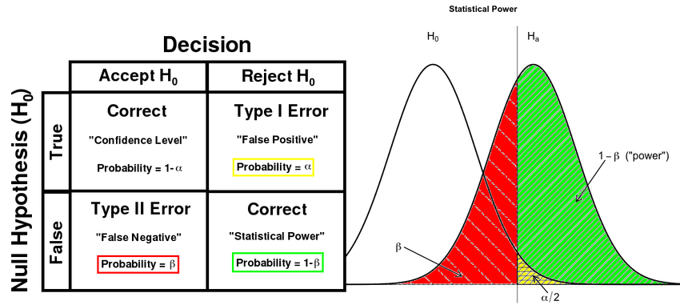

```{r setup, include=FALSE}
## Código de configuração padrão para o documento
knitr::opts_chunk$set(echo=TRUE, fig.height = 4)

```


## EXEMPLO 1{-}

Qual o limite da influência de placa regulamentação na velocidade dos automóveis, sabe-se: $\mu = 100~km/h$, $\sigma^2 = 64$ e $n = 12$. Adote $\alpha = 5%$.

- H0 : $\mu = 100~km/h$
- H1 : $\mu > 100~km/h$

Para pequenas amostras deve-se corrigir o desvio padrão pelo erro amostral: $E = \frac{\sigma}{\sqrt{n}}$


```{r example01}
mu = 100
variance = 64
n = 12

qnorm(.05, mean = mu, sd = sqrt(variance/n), lower.tail = FALSE)

hist(rnorm(n, mean = mu, sd = sqrt(variance/n)))

```

# Potência do Teste

A potência do teste é a probabilidade de rejeitar a hipótese nula quando, de fato, ela é nula.

```{r image, echo=FALSE, fig.cap="Potência Estatística", out.width='80%', fig.align='center'}


```
Fonte: [link_imagem](https://www.researchgate.net/profile/Abdulkerim-Gok/publication/316927316/figure/fig3/AS:667699772391428@1536203439714/Left-Definitions-of-terminologies-in-a-statistical-test-Right-An-illustration-of-power.ppm)

```{r power-stat}
## Normal test
# POPULAÇÃO / H1 [literatura/trabalhos anteriores]
mu = 100
sd = 4

# AMOSTRA / H0 [levantamento em campo/laboratório]
n = 10
avg = 102
avgerr = sd / sqrt(n)

## POTÊNCIA DO TESTE (manualmente)
# Distribuição H1 (população)
alpha = .05
tails = 1
zp = qnorm(alpha/tails, mean = mu, sd = avgerr, lower.tail = FALSE )
  
# Distribuição H0 (amostra)
beta = pnorm(zp, avg, avgerr)
(power = 1 - beta)

## FUNÇÃO DO R
# T-Student test
power.t.test(n = n, delta = avgerr, sd = sd, sig.level = alpha, alternative = "two.sided")
power.t.test(power = .60, delta = .5, sd=2, sig.level = .1, alternative = "one.sided")
```

# Tamanho da amostra

## A partir da população

A equação para amostras a partir da população:

$$n_0 = \frac{1}{E_0^2}$$
$$n = \frac{N \cdot n_0}{N + n_0}$$

## EXEMPLO 2

  Planeja-se um levantamento por amostragem para avaliar característica da população de 
  $N = 200$ famílias de certo bairro. Qual deve ser o tamanho mínimo de uma amostra 
  aleatória que admita erros amostrais de $4%$.
  
```{r example02}
E0 = .04
N = 200000

n0 = 1/(E0^2)

(n = N * n0 / (N + n0))

```

## Seguindo Distribuição Normal

$$n = \frac{z_{\alpha/2}^2 \cdot s^2}{E_0^2}$$

Sendo:

  - $n$ : tamanho da amostra;
  - $z_{\alpha/2}$ : limite da distribuição z-padrão
  - $E_0$ : erro amostral tolerável


## Seguindo Distribuição t-Student

$$n = \frac{t_{\alpha/2, gl}^2 \cdot s^2}{E_0^2}$$

Sendo:

  - $n$ : tamanho da amostra;
  - $t_{\alpha/2, gl}$ : limite da distribuição z-padrão
  - $E_0$ : mínimo erro amostral tolerável
  - $gl$ : graus de liberdade
  
  
```{r samples}
alpha = .05
tails = 2
sd = 4
ME = .5
df = 10

z = qnorm(alpha / tails)
(nz = (z*sd / ME)^2)

t = qt(alpha/tails, df)
(nt = (t*sd / ME)^2)

```

```{r samples-function}
alpha = .05
tails = 2
sd = 4
ME = .5
df = 10

nz <- function(sd, alpha=.05, tails=2, ME=0.5 ) {
  z = qnorm(alpha / tails)
  (z*sd / E0)^2
}


nt <- function(sd, alpha=.05, tails=2, ME=0.5, df = Inf ) {
  t = qt(alpha/tails, df)
  (t*sd / E0)^2
}

alphas <- c(.01, .05, .1, .25, .5)
sds <- c(1, 2, 4, 6, 8)

(zsamples <- outer(sds, alphas, nz))
persp(sds, alphas, zsamples, col="springgreen", theta = -30)

(tsamples <- outer(sds, alphas, nt, df = 10))
persp(sds, alphas, tsamples, col = "springgreen", theta = -30)


```
