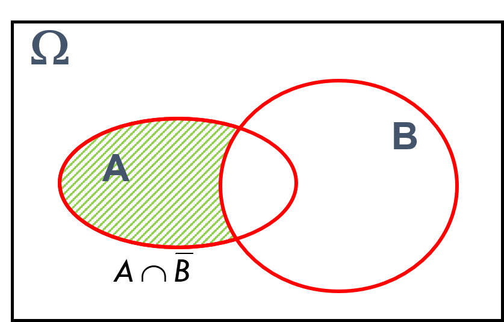

```{r setup, include=FALSE}
knitr::opts_chunk$set(echo = TRUE)
```


# Exemplo 1
<!-- Comentário no Rmarkdown CTRL + SHIFT + C -->

Defina a área destacada na figura:



A resposta do exemplo é:

$$A \cap \overline{B}$$

# Exemplo 2

Bagagens de companhias aéreas.

## Qual a probabilidade da bagagem ser entregue com defeito?
<!-- CTRL + ALT + I -->

```{r}
350 / 6850

```

## Qual a probabilidade de ser entregue pela empresa Y?

```{r}
4770 / 6850

```

## Qual a probabilidade da bagagem vir com defeito, sabendo que foi entregue pela empresa Y?

```{r}
270 / 4770
```

## Probabilidades condicionais

```{r}
#install.packages("tidyverse")
#install.packages("tibble")
#install.packages("dplyr")
library(tibble)
library(dplyr)

bd <- tibble(
  empresas = c(rep("X", 500), rep("X", 30), rep("Y", 4500), rep("Y", 270), 
               rep("Z", 1500), rep("Z", 50)),
  entregas = c(rep("normal", 500), rep("defeito", 30), rep("normal", 4500), 
               rep("defeito", 270), rep("normal", 1500), rep("defeito", 50))
)

# Probabilidade Total
# CTRL + SHIFT + M (then == ENTÃO FAÇA)

bd %>% 
  group_by(empresas, entregas) %>% 
  summarise(freq = n(), .groups = "drop") %>% 
  mutate(prob = freq / sum(freq))
  


```


