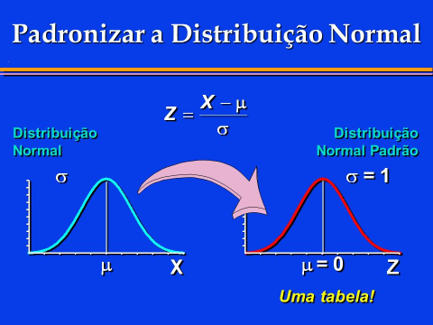
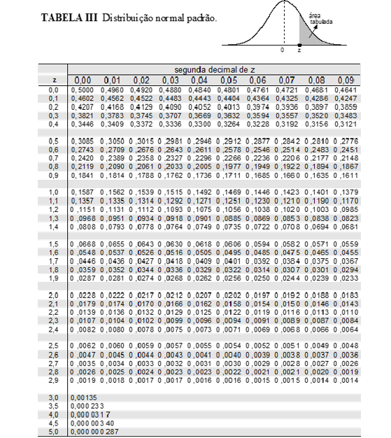
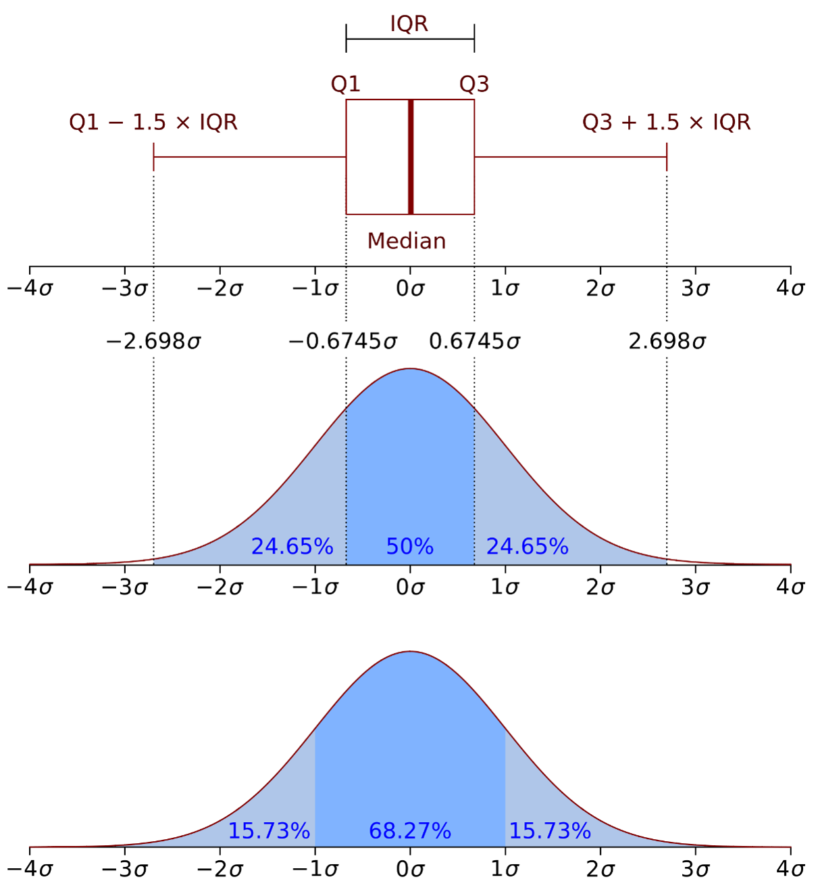
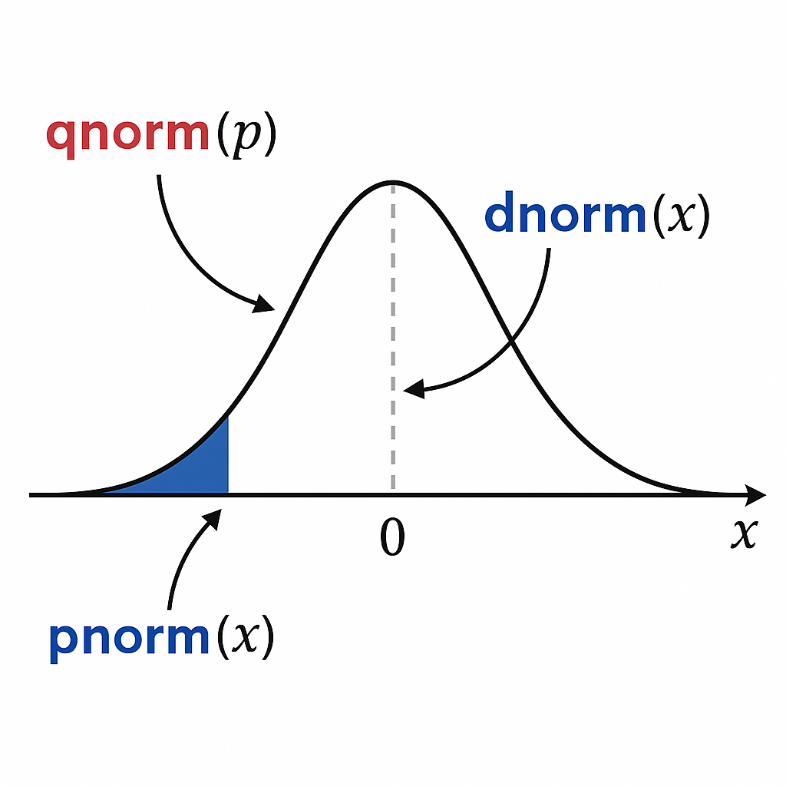
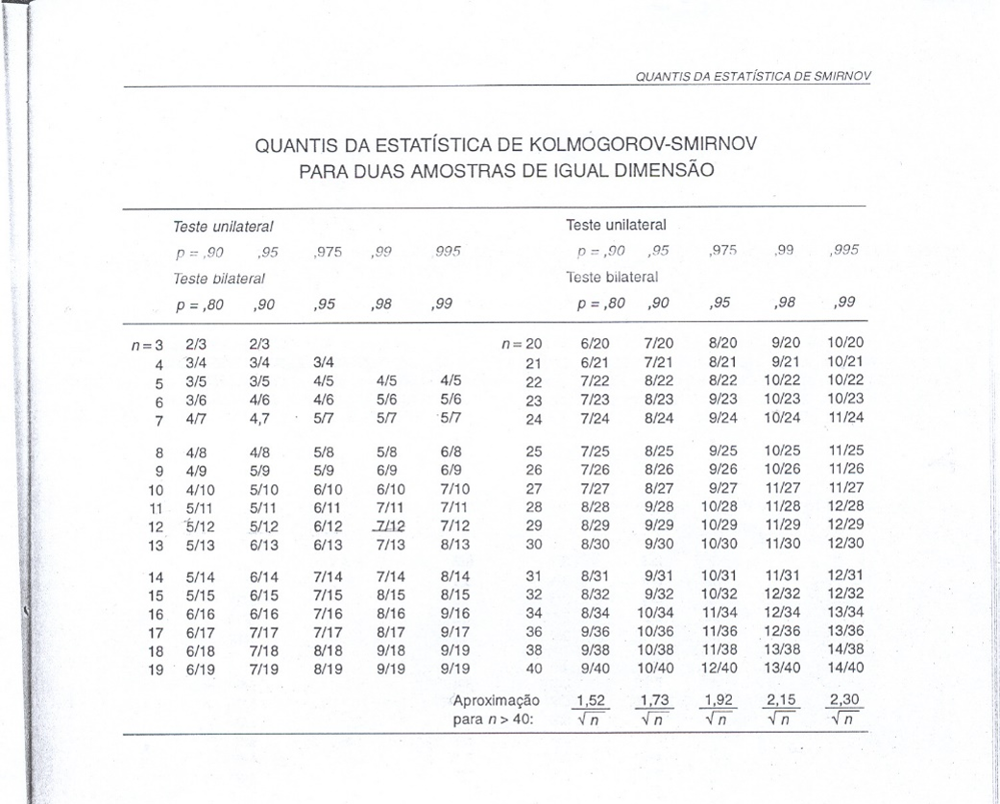

# Estatística Aplicada à  Engenharia de Transportes
Prof. André Luiz Cunha

# Distribuição Normal

## Objetivos

1.  Conceitos e usos
2.  Normal Padrão
3.  Testes de Normalidade
4.  Aplicar os testes em linguagem R

# Distribuição Normal?

## A Distribuição Normal

- *Probability Density Function*:

$$
f(x | \mu, \sigma) = \frac{1}{\sqrt{2\pi\sigma^2}} e^{-\frac{1}{2} \cdot \left( \frac{x-\mu}{\sigma} \right)^2}
$$ - Curva normal ou Gaussian (Laplace-Gauss)  
- Simétrica, unimodal  
- **Média = Mediana = Moda**  
- Área sob a curva = 1,0

------------------------------------------------------------------------

## Distribuição Normal Padrão

------------------------------------------------------------------------

------------------------------------------------------------------------

------------------------------------------------------------------------

## Funções do R

`dnorm`, `pnorm`, `qnorm` e `rnorm`

# EXEMPLO

Seja uma variável aleatória com distribuição normal padrão, calcule:

1.  P(z\>1,65)
2.  P(z\<1,65)
3.  P(1,40 \< z \< 1,70)

Utilize a tabela fornecida.

# Teste de normalidade

## Por que testar a normalidade?

- Testes estatísticos clássicos presumem normalidade
- Validação de modelos depende da adequação da distribuição
- Permite selecionar testes apropriados
- **Alternativas**:
  - métodos não-paramétricos,
  - transformações.

------------------------------------------------------------------------

## Testes de normalidade (1)

Determinando desvios de normalidade  
Deseja-se determinar se a amostra vem de uma população com distribuição
normal.

Método gráfico  
A distribuição normal tem uma função de probabilidade na forma de
**sino** e a sua distribuição acumulada de frequências uma **sigmoide**
(em forma de “S”).

------------------------------------------------------------------------

## Testes de normalidade (2)

Testes de similaridade  
teste Qui-quadrado

Outros métodos  
- Shapiro e Wilk (1950) o teste W, para n \< 5000.

- D’Agostino (1971) propôs a estatística D.

- Kolmogorov-Smirnov (1933,1939).

# Processo Estatístico

## Shapiro-Wilk Test (1965)

$$
W = \frac{(\sum a_i x_{(i)})^2}{\sum (x_i - \bar{x})^2}
$$

- Mede correlação com quantis normais
- Muito poderoso em `n < 5000`

. . .

      ``{r} 
      shapiro.test(dados)
      ``

------------------------------------------------------------------------

## Qui-Quadrado (Pearson, 1900)

$$
\chi^2 = \sum \frac{(O_i - E_i)^2}{E_i} 
$$

- Compara **observados** vs **esperados**
- Exige agrupamento dos dados
- Use a **Distribuição de Frequência**

. . .

      ``{r}
      chisq.test(x = obs, p = esperado / sum(esperado))
      ``
      

------------------------------------------------------------------------

## Tabela Qui-quadrado

------------------------------------------------------------------------

## Kolmogorov-Smirnov (1933)

$$
D = Max(|F_n(x) - F(x)|)
$$

- Compara distribuição empírica e teórica
- Aplicável entre duas amostras
- Utiliza **Distribuição de Frequência Acumulada**

. . .

      ``{r}
      ks.test(dados, "pnorm", mean = mean(dados), sd = sd(dados))
      ``

------------------------------------------------------------------------

## K-S: duas amostras (1939)

- Verifica se amostras vêm da mesma distribuição

      ``{r}
      a <- rnorm(100, mean = 50)
      b <- rnorm(100, mean = 55)
      ks.test(a, b)
      ``

------------------------------------------------------------------------

## Tabela KS

# Considerações

------------------------------------------------------------------------

- Shapiro-Wilk: sensível e poderoso
- K-S: útil mas limitado com parâmetros estimados
- Qui-quadrado: exige agrupamento e cuidado com frequências pequenas

------------------------------------------------------------------------

## Conclusão

- A normalidade é uma hipótese, não uma imposição
- Os testes devem ser compreendidos, não apenas aplicados
- A escolha metodológica depende do contexto e dos dados

> “*Todos os modelos são errados, alguns são úteis*.” — George Box

------------------------------------------------------------------------

> Um modelo é uma **representação**.
>
> Um teste é uma **decisão**.
>
> O modelo descreve o comportamento esperado dos dados.
>
> O teste avalia se as evidências empíricas apoiam ou rejeitam uma
> hipótese dentro desse modelo.

# Atividade em R

## Exercício

1.  Considere os dados de Peso (g):

    \[58, 78, 84, 90, 97, 70, 90, 86, 82, 59, 90, 70, 74, 83, 90, 76,
    88, 84, 68, 93, 70, 94, 70, 110, 67, 68, 75, 80, 68, 82, 104, 92,
    112, 84, 98, 80\]

2.  Aplique `shapiro.test`, `ks.test`, `chisq.test`

3.  Interprete
